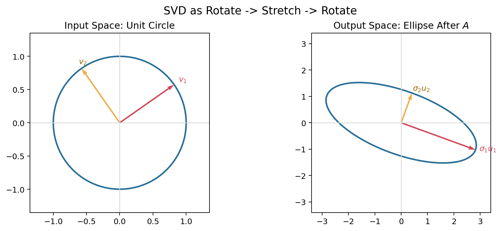
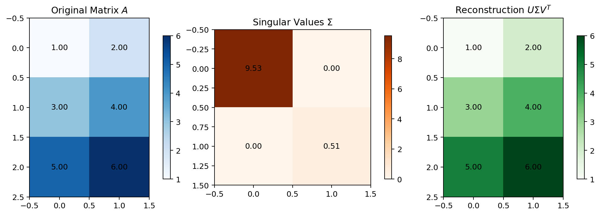
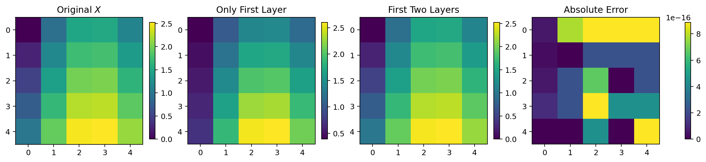
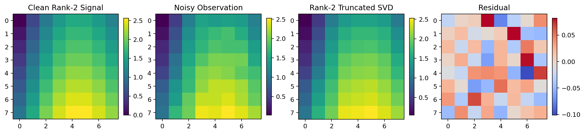
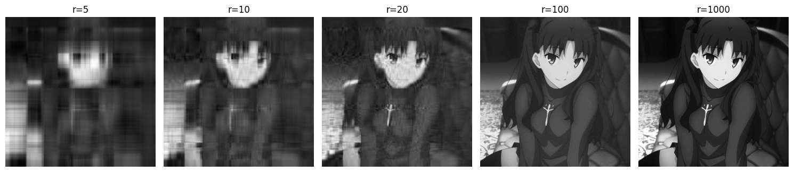

# Singular Value Decomposition (SVD)

第一次看到

\[
A = U\Sigma V^T
\]

这条公式时，很多人的感觉都差不多：看起来很标准，不知道它到底“在说什么”。

真正理解 SVD 的方式，不是死记 `U`、`Σ`、`V^T` 的名字，而是先抓住它最核心的一层意思：

> 一个复杂的线性映射，总能被拆成三件更容易理解的事：先换坐标，再沿主轴缩放，最后再换一次坐标。

这也是为什么 SVD 总会出现在压缩、降噪、推荐系统、POD、PCA、DMD 里。它做的不只是“把矩阵拆开”，而是把数据里的主结构和次要细节分开。

---

## 先看一个画面：单位圆为什么会变成椭圆

把矩阵 \(A\) 看成一个线性映射

\[
A:\mathbb{R}^n \to \mathbb{R}^m.
\]

如果先只看二维情形，那么它最直观的几何效果就是：把输入空间里的单位圆，变成输出空间里的椭圆。



这张图里，左边是输入空间的单位圆，右边是经过矩阵 \(A\) 之后的椭圆。SVD 的三部分正好对应这件事：

1. 右奇异向量 \(v_1, v_2\) 告诉你，输入空间里哪两个正交方向最重要。
2. 奇异值 \(\sigma_1, \sigma_2\) 告诉你，这两个方向分别被拉伸了多少。
3. 左奇异向量 \(u_1, u_2\) 告诉你，拉伸后的结果在输出空间里朝向哪里。

> SVD 是“旋转一下，拉伸一下，再旋转一下”。

这句话虽然不正式，但非常接近本质。

---

## 一个小的例子：一个 3x2 矩阵

比如一个很小的矩阵：

```python
import numpy as np

A = np.array([[1, 2],
              [3, 4],
              [5, 6]])

U, S, VT = np.linalg.svd(A)
```

这个例子很适合入门，因为它足够小，小到我们可以同时看见原矩阵、奇异值和重构结果。



借助 `np.linalg.svd` 函数实现SVD分解：

\[
A = U\Sigma V^T.
\]

在 NumPy 里，`S` 返回的是一维数组，我们可以：

```python
Sigma = np.zeros((A.shape[0], A.shape[1]))
Sigma[:A.shape[1], :A.shape[1]] = np.diag(S)

A_reconstructed = U @ Sigma @ VT
```

这段代码的含义非常直接：

1. `U` 是左奇异向量组成的矩阵。
2. `Sigma` 把奇异值放回主对角线上。
3. `VT` 是右奇异矩阵的转置。
4. 三者相乘以后，会把原矩阵精确还原出来。

---

## 如果不直接调用 `svd`，数学上到底是怎么得到它的

### 第一步：先看 \(A^T A\)

给定任意实矩阵

\[
A \in \mathbb{R}^{m\times n},
\]

考虑矩阵

\[
A^T A \in \mathbb{R}^{n\times n}.
\]

它有两个重要性质。

第一，它是对称矩阵，因为

\[
(A^T A)^T = A^T A.
\]

第二，它是半正定矩阵，因为对任意 \(x\in\mathbb{R}^n\)，都有

\[
x^T A^T A x = (Ax)^T(Ax) = \|Ax\|_2^2 \ge 0.
\]

这两句话非常关键。它们保证了 \(A^T A\) 的特征值是实数，而且非负。

### 第二步：对 \(A^T A\) 做特征分解

由于 \(A^T A\) 是实对称矩阵，根据谱定理，它有一组标准正交特征向量

\[
v_1, v_2, \dots, v_n,
\]

满足

\[
A^T A v_i = \lambda_i v_i,
\qquad
\lambda_i \ge 0.
\]

把这些特征值按从大到小排序：

\[
\lambda_1 \ge \lambda_2 \ge \cdots \ge \lambda_n \ge 0.
\]

现在定义

\[
\sigma_i = \sqrt{\lambda_i}.
\]

这就是奇异值。于是就有

\[
A^T A v_i = \sigma_i^2 v_i.
\]

到这里为止，右奇异向量其实已经出现了：它们就是 \(A^T A\) 的标准正交特征向量。

### 第三步：从右奇异向量构造左奇异向量

对每个满足 \(\sigma_i > 0\) 的指标，定义

\[
u_i = \frac{Av_i}{\sigma_i}.
\]

这个定义一写出来，立刻有

\[
Av_i = \sigma_i u_i.
\]

再左乘 \(A^T\)，得到

\[
A^T u_i
= A^T \frac{Av_i}{\sigma_i}
= \frac{A^T A v_i}{\sigma_i}
= \frac{\sigma_i^2 v_i}{\sigma_i}
= \sigma_i v_i.
\]

所以左右奇异向量并不是各算各的，它们满足一对非常干净的配对关系：

\[
\boxed{Av_i = \sigma_i u_i,\qquad A^T u_i = \sigma_i v_i.}
\]

### 第四步：证明这些 \(u_i\) 也彼此正交

这一步通常会被略写成一句话，但其实算一下并不难。

对任意 \(i,j\)，有

\[
u_i^T u_j
= \left(\frac{Av_i}{\sigma_i}\right)^T
\left(\frac{Av_j}{\sigma_j}\right)
= \frac{v_i^T A^T A v_j}{\sigma_i \sigma_j}.
\]

因为

\[
A^T A v_j = \sigma_j^2 v_j,
\]

所以

\[
u_i^T u_j
= \frac{v_i^T(\sigma_j^2 v_j)}{\sigma_i \sigma_j}
= \frac{\sigma_j}{\sigma_i} v_i^T v_j.
\]

而 \(v_i\) 本来就是一组标准正交向量，所以：

1. 当 \(i\neq j\) 时，\(v_i^T v_j = 0\)，于是 \(u_i^T u_j=0\)。
2. 当 \(i=j\) 时，\(v_i^T v_i = 1\)，于是 \(u_i^T u_i=1\)。

因此，\(\{u_i\}\) 也是一组标准正交向量。

### 第五步：把矩阵重新拼起来

设 \(r=\operatorname{rank}(A)\)，也就是非零奇异值的个数。把前 \(r\) 个左右奇异向量拼成矩阵

\[
U_r=[u_1,\dots,u_r],\qquad
V_r=[v_1,\dots,v_r],
\]

再定义对角矩阵

\[
\Sigma_r = \operatorname{diag}(\sigma_1,\dots,\sigma_r).
\]

由于每一列都满足

\[
Av_i = \sigma_i u_i,
\]

把它们按列写在一起，就得到

\[
A V_r = U_r \Sigma_r.
\]

现在任取一个向量 \(x\in\mathbb{R}^n\)。因为 \(v_1,\dots,v_n\) 构成一组标准正交基，所以

\[
x = \sum_{i=1}^n \alpha_i v_i.
\]

于是

\[
Ax = \sum_{i=1}^n \alpha_i Av_i.
\]

对于前 \(r\) 项，\(Av_i=\sigma_i u_i\)；对于后面的零奇异值项，有 \(Av_i=0\)。所以

\[
Ax = \sum_{i=1}^r \alpha_i \sigma_i u_i.
\]

另一方面，先算 \(V^T x\)，得到的就是向量在基 \(\{v_i\}\) 下的坐标；再乘 \(\Sigma\)，就是把这些坐标按奇异值缩放；最后再乘 \(U\)，就是把缩放后的结果放回输出空间。因此对所有 \(x\) 都有

\[
Ax = U\Sigma V^T x.
\]

于是

\[
\boxed{A = U\Sigma V^T.}
\]

到这里，SVD 的存在性就完整推出来了。

---

## 这件事为什么和“秩”天然绑在一起

SVD 最有力量的地方，不只是它存在，而是它能把矩阵写成一层一层的结构：

\[
\boxed{
A = \sum_{i=1}^{r} \sigma_i u_i v_i^T
}
\]

这里每一项

\[
\sigma_i u_i v_i^T
\]

都是一个秩 1 矩阵。

这意味着什么？

它意味着一个秩为 \(r\) 的矩阵，本质上就是 \(r\) 个秩 1 模式的加权和。奇异值越大，对整体结构的贡献越大；奇异值越小，越像细节、噪声、局部扰动。

这就是 `svd1.py` 里“逐层重构”的数学来源：

```python
U, S, VT = np.linalg.svd(X, full_matrices=False)
layers = np.array([S[i] * np.outer(U[:, i], VT[i, :]) for i in range(len(S))])
reconstructions = np.cumsum(layers, axis=0)
```

代码里 `layers[i]` 对应的就是

\[
\sigma_i u_i v_i^T.
\]

---

## `svd1.py` 的数据天生就是秩 2

`svd1.py` 的核心构造不是随机的，而是非常刻意的：

```python
x = np.linspace(0.0, 1.0, n)
y = np.linspace(0.0, 1.0, n)
X_grid, Y_grid = np.meshgrid(x, y)

X = X_grid + Y_grid + np.sin(3.0 * X_grid)
g = x + np.sin(3.0 * x)
X_factored = np.outer(y, np.ones(n)) + np.outer(np.ones(n), g)
```

把矩阵元素写开：

\[
X_{ij} = x_j + y_i + \sin(3x_j).
\]

令

\[
g_j = x_j + \sin(3x_j),
\]

那么

\[
X_{ij} = y_i + g_j.
\]

因此整个矩阵可以写成

\[
\boxed{
X = y\mathbf 1^T + \mathbf 1 g^T
}
\]

这一步非常重要，因为它一下子暴露了结构：

1. \(y\mathbf 1^T\) 是秩 1 矩阵。
2. \(\mathbf 1 g^T\) 也是秩 1 矩阵。

所以

\[
\operatorname{rank}(X) \le 2.
\]

另一方面，每一列都可以写成

\[
X_{:,j} = y + g_j \mathbf 1.
\]

因此列空间由 \(\mathbf 1\) 和 \(y\) 张成。由于脚本里的 \(y\) 不是常向量，所以 \(\mathbf 1\) 和 \(y\) 线性无关，列空间维数正好是 2。于是

\[
\boxed{\operatorname{rank}(X)=2.}
\]



上图里你会看到一个非常干净的现象：

1. 只保留第一层时，矩阵已经很像原矩阵。
2. 加上第二层以后，原矩阵被完整恢复。
3. 后面的层理论上都应该是 0，数值上只剩浮点误差。

---

## 为什么只保留前几个奇异值

如果已经有了分层展开

\[
A = \sum_{i=1}^{r} \sigma_i u_i v_i^T,
\]

那么最自然的想法就是：只保留前 \(k\) 层。

定义

\[
A_k = \sum_{i=1}^{k} \sigma_i u_i v_i^T.
\]

这就是 rank-\(k\) 截断 SVD。

它为什么合理？因为误差正好就是剩下那些层：

\[
A - A_k = \sum_{i=k+1}^{r} \sigma_i u_i v_i^T.
\]

而这些秩 1 项在 Frobenius 内积下彼此正交，所以

\[
\|A-A_k\|_F^2 = \sum_{i=k+1}^{r} \sigma_i^2.
\]

这条式子其实已经把核心说完了：

1. 你丢掉的不是“某些列”或“某些行”，而是丢掉了尾部奇异方向。
2. 丢掉的总能量，正好是尾部奇异值平方之和。
3. 因为奇异值本来就是按从大到小排好的，所以保留前 \(k\) 项，就是在固定预算下尽量保住最多的结构。

这就是 Eckart-Young 定理背后的直觉，也是在很多实际问题里“保留前几个模态”如此自然的原因。

在代码里，这件事通常只需要一行：

```python
X_r = U[:, :r] @ np.diag(S[:r]) @ VT[:r, :]
```

---

## `svd2.py`：低秩结构一旦被噪声污染，会发生什么

`svd2.py` 把 `svd1.py` 的低秩结构保留下来，再叠加一层小噪声：

```python
rng = np.random.default_rng(seed)
noise = noise_level * rng.standard_normal(size=X_clean.shape)
X_noisy = X_clean + noise
```

从数学上说，`X_clean` 仍然是精确秩 2，但 `X_noisy` 通常不再是秩 2。原因也很简单：随机噪声几乎总会把原本的零奇异值抬起来，让矩阵变成满秩。

不过这里最重要的并不是“满秩”这件事，而是另一个更实用的事实：

> 噪声会让尾部奇异值从 0 变成小的非零值，但通常不会改变前几个主导奇异值的统治地位。

所以只要噪声不大，前两个奇异值仍然主要代表原来的结构，而后面的奇异值更多代表扰动和细节。

`svd2.py` 的核心截断代码就是：

```python
U, S, VT = np.linalg.svd(X_noisy, full_matrices=False)
X_r = U[:, :r] @ np.diag(S[:r]) @ VT[:r, :]
```



上图最值得注意的是：

1. `X_noisy` 看起来已经不是干净的低秩结构了。
2. 只保留前两个奇异值以后，`X_r` 重新抓回了主轮廓。
3. 剩下的残差，更多像是碎噪声，而不是整体结构。

这就是为什么截断 SVD 经常能起到降噪作用。它不是“平滑一下”，而是把数据投影回那个最重要的低维子空间。

---

## `SVD.ipynb` 里还有一条特别经典的线：图像压缩

Notebook 后半段做的是另一件很有代表性的事：把图片当成矩阵，然后做低秩近似。

原始思路很简单：

```python
from matplotlib.image import imread

A = imread(...)
X = np.mean(A, axis=-1)          # 转成灰度图
U, S, VT = np.linalg.svd(X, full_matrices=False)

Xapprox = U[:, :r] @ np.diag(S[:r]) @ VT[:r, :]
```

本质上，图像压缩并没有用到什么“图像专属算法”。它做的仍然是那件熟悉的事：

1. 把矩阵写成奇异方向的叠加。
2. 只保留最重要的前几层。
3. 用较少的结构，重构出主要视觉内容。

原始图片和黑白版本：


前`r`个奇异值重建的图片



这里很容易看出一个典型规律：

1. 当秩很小时，图像先保住的是大轮廓和低频结构。
2. 随着秩增加，边缘、纹理和细节慢慢回来。
3. 小奇异值对应的，往往就是那些“看起来重要性较低”的微小变化。

这也解释了为什么 SVD 对图像压缩如此自然。它不是在“删像素”，而是在“删掉那些对整体结构贡献较小的奇异方向”。

除了直接调用 `np.linalg.svd`，下面展示了如何从 \(A^TA\) 手工恢复出 SVD 的主要部分。

```python
ATA = A.T @ A
eigvals_V, V = np.linalg.eig(ATA)

sort_idx = np.argsort(eigvals_V)[::-1]
eigvals_V = eigvals_V[sort_idx]
V = V[:, sort_idx]

singular_values = np.sqrt(np.maximum(eigvals_V, 0))

U_fixed = np.zeros((3, 2))
for i in range(len(singular_values)):
    U_fixed[:, i] = (A @ V[:, i]) / singular_values[i]
```

这段代码几乎就是本文数学推导的直接翻译：

1. 先算 \(A^T A\)。
2. 求它的特征值和特征向量。
3. 特征值开方得到奇异值。
4. 用
   \[
   u_i = \frac{Av_i}{\sigma_i}
   \]
   构造左奇异向量。

它特别适合做一件事：把“公式”和“代码”真正连起来。

---

## 最后，把整件事压缩成三句话

如果读到这里，你还想给 SVD 留下一个尽可能短但尽可能准的印象，那我会建议记下面这三句话：

1. SVD 先找到输入空间里最重要的正交方向。
2. 它沿这些方向分别缩放，再映射到输出空间里的对应方向。
3. 只保留前几个奇异值，本质上就是只保留最重要的结构层。

所以，SVD 真正擅长的不是“分解矩阵”这件表面工作，而是：

\[
\boxed{
\text{把结构和细节分开，把主导模式和尾部扰动分开。}
}
\]

一旦你真的把这层意思看清，公式

\[
A = U\Sigma V^T
\]

就不再只是一个矩阵分解形式，而是一种看数据的方式。
